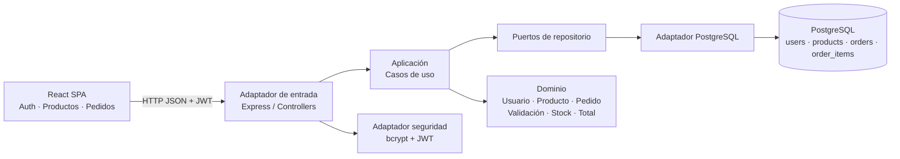

# Arquitectura

La aplicación sigue arquitectura hexagonal: el dominio expresa reglas puras; aplicación coordina casos de uso y consume repositorios por contratos; infraestructura conecta PostgreSQL y HTTP/Express. El frontend consume la API a través de `src/api.js`.

## Entidades y relaciones

- **Usuario**: `users`; correo único, rol y hash bcrypt de la contraseña.
- Usuarios nuevos usan rol `user` y empiezan sin acceso a productos ni pedidos. El administrador concede `can_access_products` y `can_access_orders` de forma independiente; rol `admin` omite ambos permisos. La API recarga permisos desde PostgreSQL en cada petición para aplicar cambios inmediatamente.
- **Producto**: `products`; precio no negativo e inventario entero no negativo.
- **Pedido**: `orders`; pertenece a un usuario. `order_items` materializa la relación muchos a muchos con productos y conserva precio unitario histórico.
- Crear un pedido abre una transacción, descuenta existencias de forma condicional y confirma pedido y partidas juntos; cualquier error revierte todo.

## Capas

- `src/domain`: validaciones y cálculo de importes, sin dependencias de Express ni PostgreSQL.
- `src/application`: casos de uso y contratos de repositorio.
- `src/infrastructure`: adaptador SQL, hashing, JWT y transporte HTTP.
- `frontend/src`: componentes de interfaz y cliente HTTP desacoplado.

El catálogo requiere permiso de productos. Para crear pedidos se requieren los permisos de productos y pedidos, ya que el checkout valida y descuenta inventario. Los usuarios solo consultan o eliminan sus pedidos; únicamente el administrador cambia estados.
